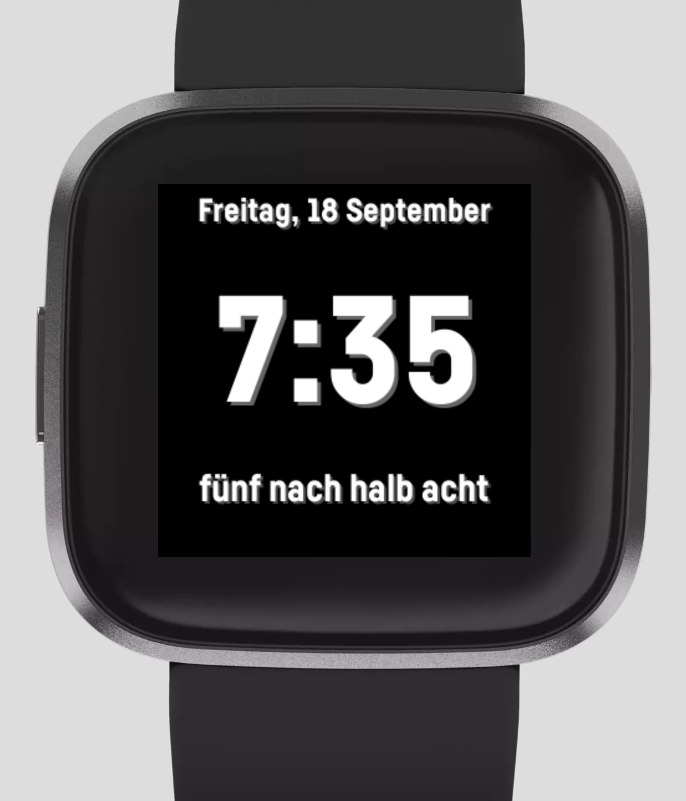
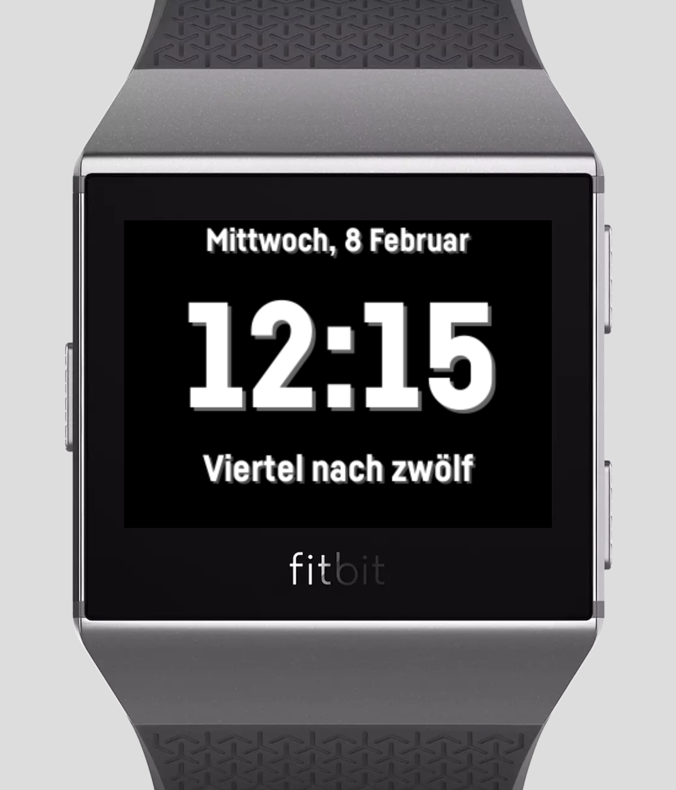

Die Zeit [](https://gallery.fitbit.com/details/661063e3-60d4-4b50-a2a1-5bfacca11bb3) [](https://gitter.im/die-zeit/community?utm_source=badge&utm_medium=badge&utm_campaign=pr-badge&utm_content=badge) [](https://travis-ci.com/Shpota/zeit) [](https://codecov.io/gh/Shpota/zeit)
========
A simple Fitbit clock face for learners of the German
language. The clock face shows time in numeric format
and duplicates it in German transcript. You can download
the app
[from the Fitbit App Gallery](https://gallery.fitbit.com/details/661063e3-60d4-4b50-a2a1-5bfacca11bb3).

  

## How to build

Setup the build environment following 
[the guide](https://dev.fitbit.com/build/guides/command-line-interface/).

Build:
```shell script
npm install
npm run build
```
Run tests:
```shell script
npm test
```

## How to contribute
 
If you found a bug or have an idea on how to improve the project
[open an issue](https://github.com/Shpota/zeit/issues)
and I will fix it as soon as possible.
 
You can also propose your changes via a Pull Request.
Fork the repository, make changes, send me a pull request
and I'll review it shortly.

## Supported devices
- Versa 2
- Versa
- Versa Light
- Ionic
